# Proyecto InkaVida

**InkaVida** es una aplicación móvil diseñada para ayudar a los usuarios a llevar un estilo de vida saludable a través de la gestión de su alimentación y ejercicio. La app permite a los usuarios acceder a un sistema de seguimiento de su dieta, registrar sus platillos favoritos, configurar su perfil y mucho más. Está construida utilizando **React Native** y **Expo Go**, lo que permite un desarrollo ágil y compatibilidad tanto con dispositivos Android como iOS.

## Características principales:
- Registro y autenticación de usuarios.
- Vista principal con un menú fácil de navegar.
- Registro de platillos por categoría (Carne, Pollo, Vegetales).
- Gestión del perfil y configuración personalizada.
- Opciones para agregar y editar categorías de platillos.


## Tecnologías

```
→ React Native
→ Expo Go
→ Emulador opcional (Nox) o Dispositivo Android o iOS
→ Diseño UX/UI: Figma

```

### Interfaz Principal
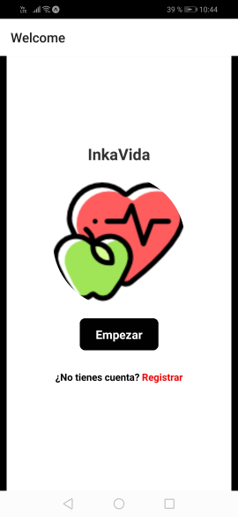
La vista principal donde los usuarios pueden acceder a todas las funcionalidades de la app, desde el inicio hasta las opciones de menú.

### Interfaz Login
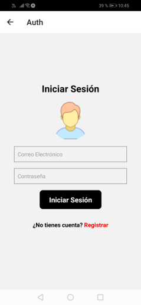
Pantalla de inicio donde los usuarios pueden ingresar con su cuenta para acceder a sus datos personalizados.


### Interfaz Registro
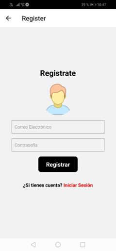
Pantalla de registro para nuevos usuarios que deseen crear una cuenta en la app.


### Interfaz Home
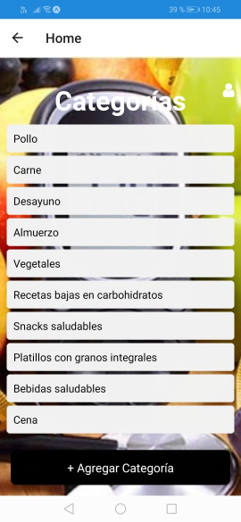
Una vez que el usuario haya iniciado sesión, la vista principal del hogar muestra su progreso, opciones y acceso rápido a funcionalidades como el registro de platillos.

### Platillo Carne
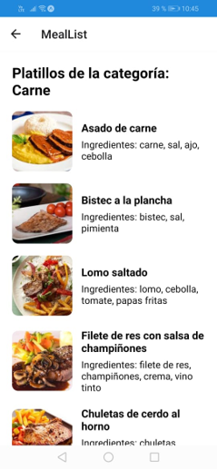
Vista de un platillo con carne registrado en la aplicación. El usuario puede añadir o modificar los detalles del platillo.

### Platillo Pollo
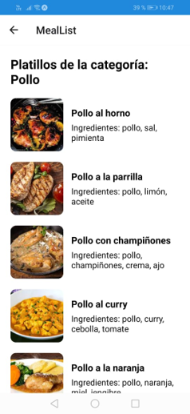
Vista de un platillo con pollo registrado en la aplicación, con la opción de agregar más detalles.

### Platillo Vegetales
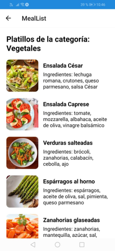
Pantalla donde se visualiza un platillo con vegetales, también editable por el usuario.


### Interfaz Agregar Categorías
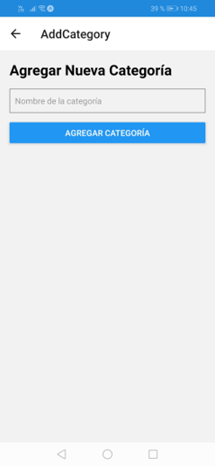
Pantalla donde el usuario puede agregar nuevas categorías para organizar mejor los platillos y alimentos.

### Interfaz Perfil
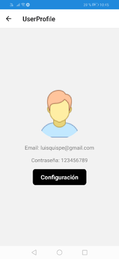
En esta sección los usuarios pueden ver y editar su perfil, incluyendo información personal y preferencias.


### Interfaz Configuración
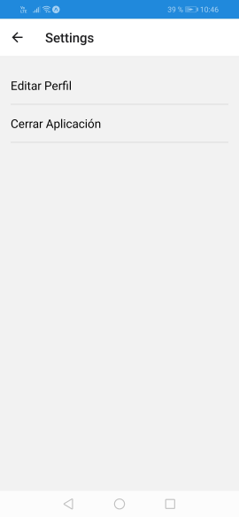
Desde esta pantalla, el usuario puede ajustar diferentes preferencias y configuraciones de la app.

### Interfaz Editar Perfil
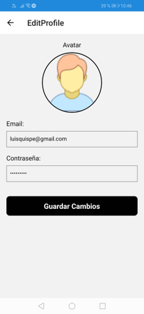
Permite a los usuarios modificar los datos de su perfil, como nombre, foto, preferencias, etc.

### Usuario Registrado Estatico:
```
const users = [
  { email: 'giancarlos@gmail.com', password: '123456789' },
  
];
```
